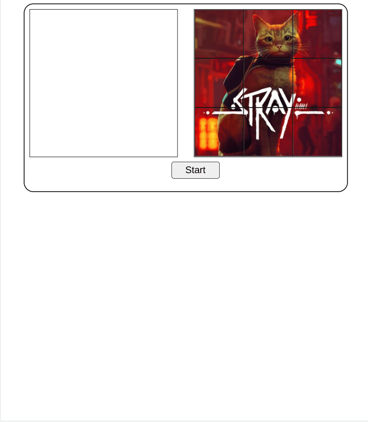
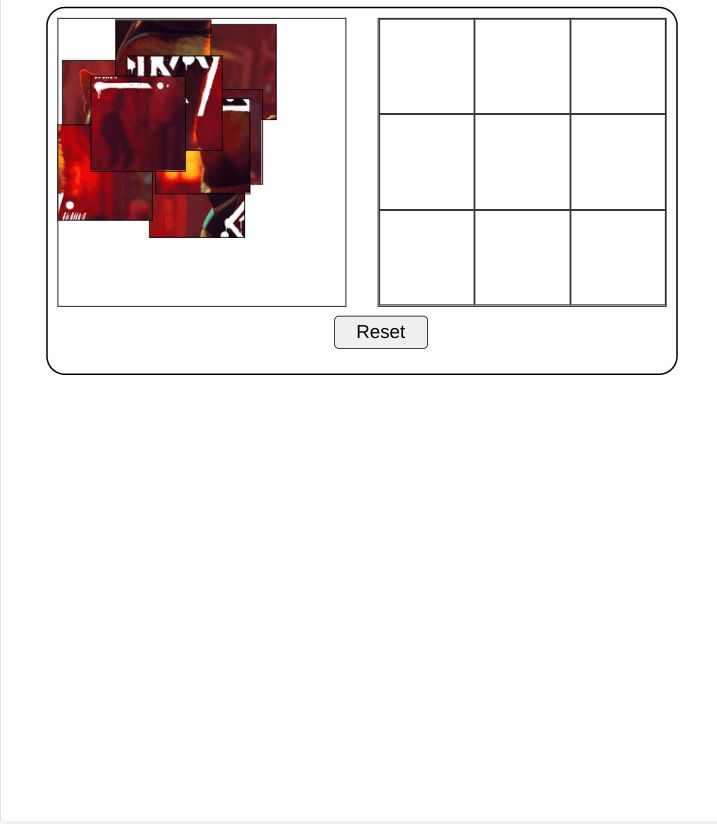
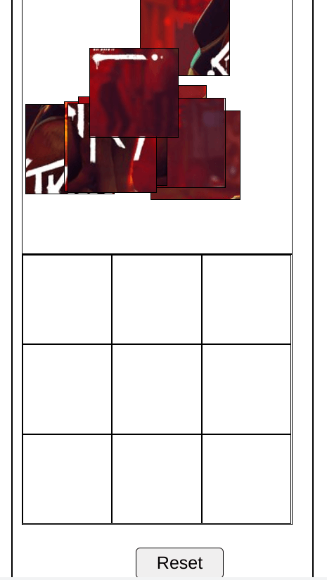

# JS Picture Puzzle Game

Inspiration from [Alienware Arena](https://alienwarearena.com) picture game where a user has to reassemble an image within 30 seconds to win ARP (Alienware Reward Points) or a game key. Used this [tutorial](https://www.youtube.com/watch?v=6mgsMcOwfoE) to help build out game.  

## Screenshots

## Links 

- [Github Pages](https://jdegand.github.io/js-picture-puzzle-game)

## Thoughts

- I usually use libraries for drag and drop functionality
- Drag and drop examples with images rely on swapping src values of the images - not using background images
- Kenny Yip Coding tutorial had many images created beforehand.  I looked into finding websites that could slice images as well.  
- Using background-position to create various pieces is clever.  
- Random pieces can go outside of border of pieceContainer - tough to get precise
- mobile slight tweaks - swap piece container and image containers ?
- You can cheat the game by inspecting pieces - harder to do if there was a timer

## Continued Development

- Mobile
- Favicon
- Timer
- Move the picture bank below the image
- Add a start screen vs start button
- Styling
- Accessibility
- Refactor JS code - createPieces function
- Recreate in React or Angular

## Useful Resources

- [Pic Resize](https://picresize.com/) - used to shrink original picture
- [YouTube](https://www.youtube.com/watch?v=6mgsMcOwfoE) - Jigsaw Puzzle using jQuery UI draggable and droppable Interactions
- [YouTube](https://www.youtube.com/watch?v=S6GNtMGNcUE) - Kenny Yip Coding puzzle game
- [YouTube](https://www.youtube.com/watch?v=jfYWwQrtzzY) - Drag and Drop
- [You Might Not Need JQuery](https://youmightnotneedjquery.com/) - convert from jquery back to vanilla js
- [Stack Overflow](https://stackoverflow.com/questions/5191478/changing-element-style-attribute-dynamically-using-javascript) - changing element style dynamically with js
- [MDN Docs](https://developer.mozilla.org/en-US/docs/Web/API/CSSStyleDeclaration/setProperty) - setProperty
- [MDN Docs](https://developer.mozilla.org/en-US/docs/Web/API/HTML_Drag_and_Drop_API/Drag_operations#specifying_drop_targets) - drag and drop
- [MDN Docs](https://developer.mozilla.org/en-US/docs/Web/API/DataTransfer/types) - DataTransfer types
- [Codepen](https://codepen.io/kalenenc/pen/MmpKKd) - vanilla js drag and drop
- [Stack Overflow](https://stackoverflow.com/questions/37347690/how-to-replace-div-with-another-div-in-javascript) - replace div with another div js (replaceWith)
- [Codepen](https://codepen.io/Coding_Journey/pen/YzKpLvE) - drag and drop
- [YouTube](https://www.youtube.com/watch?v=7HUCAYMylCQ) - drag and drop
- [Web.dev](https://web.dev/drag-and-drop/) - drag and drop
- [CSS Tricks](https://css-tricks.com/creating-a-parking-game-with-the-html-drag-and-drop-api/) - Parking game
- [Stack Overflow](https://stackoverflow.com/questions/43130531/background-image-clipped-to-draggable-div) - background image clipped to draggable div
- [YouTube](https://www.youtube.com/watch?v=gjiu9kB7fQc) - drag and drop
- [Stack Overflow](https://stackoverflow.com/questions/56435353/why-does-the-html-drag-and-drop-datatransfer-become-an-object-inside-of-iframe) - datatransfer object instead
- [Stack Overflow](https://stackoverflow.com/questions/56461743/getting-object-htmldivelement-instead-of-its-content) - getting object htmldivelement instead of its content
- [Stack Overflow](https://stackoverflow.com/questions/3168569/how-do-i-use-jquery-uis-highlight-and-error-widgets) - jquery ui highlight
- [Stack Overflow](https://stackoverflow.com/questions/11286661/set-custom-attribute-using-javascript) - set custom attribute using js
- [MDN Docs](https://developer.mozilla.org/en-US/docs/Web/API/Event/composedPath) - Event.composedPath()
- [Stack Overflow](https://stackoverflow.com/questions/32555092/javascript-queryselectorall-elements-order) - querySelectorAll order
- [Stack Overflow](https://stackoverflow.com/questions/22395357/how-to-compare-two-arrays-are-equal-using-javascript) - compare two arrays js
- [JavaScript Tutorial](https://www.javascripttutorial.net/dom/manipulating/remove-all-child-nodes/) - remove all child nodes
